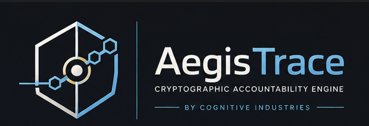
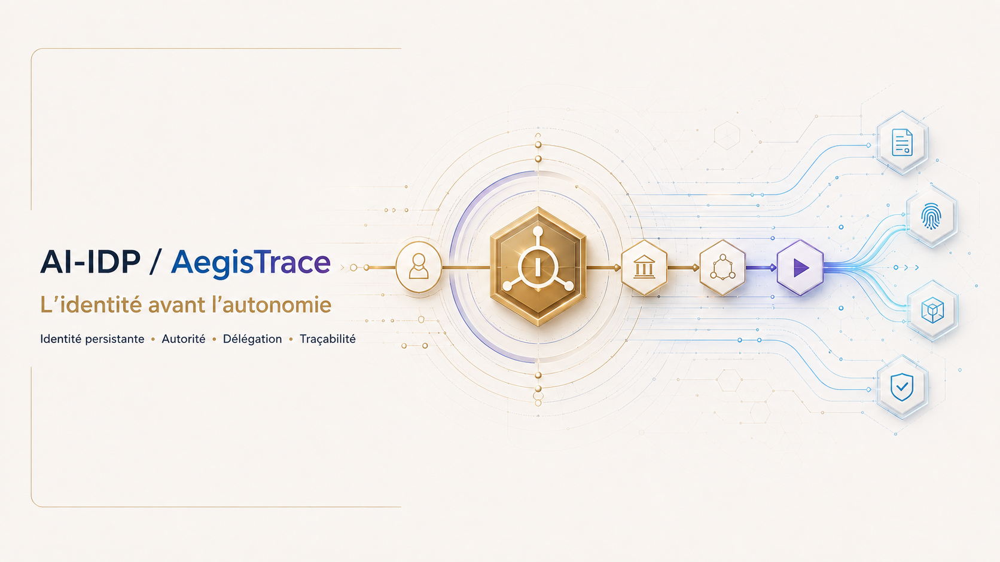

<!--
© 2026 Pierre-Edward Procyk. All rights reserved.
IP_HEADER: Public project overview for AI-IDP and AegisTrace.
DATA_HEADER: Consumer explanations are separated from verified implementation and external-activation claims.
CODE_ANNOTATION: v2.1.0 | 2026-09-07 | Consumer-first GitHub presentation.
-->

<p align="center">
  
</p>

<table>
  <tr>
    <td width="50%" align="center">
      
    </td>
    <td width="50%" align="center">
      
    </td>
  </tr>
</table>

# AI-IDP + AegisTrace

**Identity before autonomy. Proof after action.**

AI-IDP and AegisTrace are a proposed governance framework and a working reference implementation for a practical question:

> When an AI system takes an action, can we determine which AI actor acted, who authorized it, what limits applied, and what evidence remains afterward?

**Current version:** 2.1.0<br>
**Implementation:** Functional Python reference implementation<br>
**Legal status:** Proposed framework; not current Canadian law<br>
**Licence status:** All Rights Reserved; no public software, logo, or media licence is granted<br>
**Archived DOI:** [10.5281/zenodo.21769036](https://doi.org/10.5281/zenodo.21769036) records the earlier archived release and does not by itself certify version 2.1.0

[Plain-language guide](docs/consumer-guide.md) · [Visual gallery](docs/media/README.md) · [Technical quick start](docs/quickstart.md) · [Verified status](project-control/PROJECT_STATUS.md) · [Validation evidence](project-control/VALIDATION_STATUS.md)

---

## The idea in one minute

AI systems are moving from answering questions to carrying out tasks. They can prepare decisions, call tools, modify records, trigger workflows, and interact with other systems. Once an AI can act, a simple activity log is not enough.

A trustworthy record should answer six questions:

1. **Which AI actor acted?**
2. **Which running instance performed the action?**
3. **Who had authority over it?**
4. **What delegation, approval, and limits applied?**
5. **What action occurred, in what context?**
6. **What signed evidence remains for independent verification?**

AI-IDP governs the questions that must be answered **before** an AI action. AegisTrace records and verifies the evidence **after** the action.



---

## Two parts, one accountability chain

| Before an action: AI-IDP | After an action: AegisTrace |
|---|---|
| Identifies the AI actor and runtime instance | Creates a signed event record |
| Connects the actor to a principal and controller | Links the event to the previous event |
| Defines authority, delegation, scope, and limits | Preserves hashes, timestamps, and signatures |
| Supports approval and policy decisions | Verifies integrity and reconstructs the sequence |
| Fails closed when required authority is missing | Produces public-safe or restricted evidence views |

The goal is not to make AI infallible. The goal is to make authorized AI action **bounded, attributable, reviewable, and reconstructible**.

## A familiar example

Imagine an AI assistant that can prepare and submit a purchase request.

Before submission, an organization should be able to establish:

- which registered AI actor and instance is operating;
- who controls it and on whose behalf it acts;
- what spending category and limit were delegated;
- whether a person or policy approved this exact action;
- which data and tools the AI was permitted to use.

After submission, an auditor should be able to verify:

- the action that was requested and executed;
- the authorization and approval that covered it;
- the exact action intent, including important parameters;
- the event sequence and cryptographic signatures;
- whether the evidence was altered or the chain was broken.

That before-and-after relationship is the core of AI-IDP and AegisTrace.

---

## What version 2.1.0 implements

The repository contains working source and tests for:

- persistent identifiers for principals, controllers, AI actors, runtime instances, tasks, delegations, authorizations, approvals, resources, and events;
- fail-closed authorization with multidimensional scope and exact-action approval binding;
- bounded recursive delegation and verifiable lineage;
- authenticated governed API writes with proof-of-possession and replay resistance;
- append-only, hash-chained ledgers with signed events and Merkle evidence;
- public-safe disclosure projections that exclude restricted fields by default;
- SQLite and PostgreSQL persistence paths;
- software signing, PKCS#11/HSM adapters, and managed-cloud KMS adapters;
- post-quantum signing paths through an explicitly provisioned liboqs runtime;
- signed federation agreements and cross-registry verification;
- OpenTelemetry and GitHub integration adapters;
- specifications, JSON Schemas, threat modelling, policy analysis, and conformance tests.

Implemented source does not automatically mean that every external service, cloud credential, hardware token, registry operator, or production environment has been activated. See [Validation status](project-control/VALIDATION_STATUS.md) for that boundary.

## What this project does not claim

- AI-IDP is **not current Canadian law**.
- AegisTrace is a reference implementation, **not proof of a production deployment**.
- A local or CI test is **not external certification or regulatory acceptance**.
- A cloud, HSM, PostgreSQL, telemetry, federation, or GitHub adapter in source is **not proof that a live external service was exercised**.
- Indigenous rights-holder engagement is **not a universal gate for unrelated deployments**; it is required where applicable rights, community data, governance authority, agreements, or services are materially involved.
- The project does not grant a public licence to source, logos, media, documents, or trademarks by implication.

---

## Verified engineering snapshot

The 2026-09-07 local verification of version 2.1.0 recorded:

| Gate | Result |
|---|---|
| Python | 3.12.10 |
| Ruff | Passed over `src` and `tests` |
| MyPy | Passed; 80 source/test files |
| Pytest | 162 passed; 2 explicitly opt-in native-PQC tests skipped |
| Windows build | All seven stages passed; exit code 0 |
| Governed demo | 4 events; `GOVERNED`; verification `OK` |
| Ledger verification | Event hashes, hash chain, and 4 signatures verified |
| Wheel | `aegistrace-2.1.0-py3-none-any.whl` |
| Paper | Tectonic 0.16.9 completed; 13-page PDF |
| Container | Not executed because the Docker Desktop Linux engine was unavailable |

The wheel built from the publication candidate was 114,572 bytes with SHA-256 `e8d6a56ae539ef26e7819cdec58b88ca889c65f9d8c3111c10ca44cbbaf97929`.

Earlier verification disclosed a Starlette TestClient deprecation warning; the publication candidate adopts Starlette’s current `httpx2` test dependency. Paper-layout/fontconfig warnings remain disclosed and did not fail compilation. Native post-quantum round trips remain explicit opt-in because importing liboqs-python can download and compile native code when liboqs is absent.

---

## Try the reference implementation

### Windows

The guided path is:

```powershell
.\BUILD_WINDOWS.bat
```

The manual path is:

```powershell
py -3.12 -m venv .venv
.\.venv\Scripts\Activate.ps1
python -m pip install -e ".[test-full]"
python -m pytest tests -q
python -m aegistrace.cli admin demo --out .aitrace-demo
python -m aegistrace.cli verify --ledger .aitrace-demo\ledger.jsonl --keys .aitrace-demo\public_keys.json
```

### macOS or Linux

```bash
python3.12 -m venv .venv
source .venv/bin/activate
python -m pip install -e '.[test-full]'
python -m pytest tests -q
python -m aegistrace.cli admin demo --out .aitrace-demo
python -m aegistrace.cli verify --ledger .aitrace-demo/ledger.jsonl --keys .aitrace-demo/public_keys.json
```

For native ML-DSA and SLH-DSA verification, provision a compatible liboqs environment and use the separate `pqc` dependency extra. Those tests are deliberately not part of an ordinary validation run.

---

## Explore the project

| If you are… | Start here |
|---|---|
| New to AI accountability | [Plain-language guide](docs/consumer-guide.md) |
| Looking for the visual explanation | [AI-IDP/AegisTrace gallery](docs/media/README.md) |
| Evaluating the current evidence | [Project status](project-control/PROJECT_STATUS.md) and [validation status](project-control/VALIDATION_STATUS.md) |
| Implementing or testing the code | [Quick start](docs/quickstart.md), [developer guide](docs/developer-guide.md), and `src/aegistrace/` |
| Reviewing the standard | [Core specification](spec/AI-IDP-CORE.md) and `spec/` |
| Auditing evidence | [Auditor guide](docs/auditor-guide.md) and [audit protocol](spec/AUDIT_PROTOCOL.md) |
| Reviewing public disclosure | [Privacy policy](PRIVACY.md) and `src/aegistrace/disclosure/` |
| Reviewing security | [Security policy](SECURITY.md) and [threat model](threat-model/THREAT_MODEL.md) |
| Reviewing Canadian policy work | `government/`, `research/`, `university/`, and `impact/` |
| Reusing project media | Read [brand and media rights](TRADEMARK_AND_BRAND_POLICY.md) first |

## Repository map

```text
ai-idp/
├── brand/                 Official Cognitive Industries and project marks
├── docs/                  Consumer, developer, auditor, and regulator guidance
│   └── media/             Public visual gallery and provenance records
├── government/            Canadian policy and legal-analysis package
├── impact/                Business, workforce, societal, and environmental analysis
├── paper/                 Research-paper source
├── project-control/       Current status, validation, decisions, and checkpoints
├── research/              Research protocol, sources, contradictions, and synthesis
├── schemas/               Machine-readable contracts
├── spec/                  AI-IDP technical and governance specifications
├── src/aegistrace/        Python reference implementation
├── tests/                 Unit, integration, security, privacy, permanence, and conformance tests
└── threat-model/          Security model and attack analysis
```

---

## Privacy, rights, and responsible use

AegisTrace is designed to preserve accountability evidence without making sensitive content public by default. Its public projections are allow-listed, identifiers can be pseudonymous, sensitive records can remain sealed, and restricted evidence can be separated from public verification data.

Where a deployment materially involves Indigenous rights, community data, governance authority, agreements, or services, meaningful distinctions-based rights-holder engagement remains part of responsible implementation. That responsibility is contextual rather than a universal prerequisite for unrelated deployments.

Implementers remain responsible for the laws, contracts, policies, human-rights obligations, privacy requirements, and community-governance duties that apply to their actual deployment.

---

## Brand, copyright, and media

The Cognitive Industries, AI-IDP, and AegisTrace names, official marks, visual system, article/post graphics, source code, specifications, and documentation are proprietary works of Pierre-Edward Procyk and Cognitive Industries — Les Industries Cognitives.

The assets are displayed in this repository to identify and explain the project. Their presence does not grant permission to reproduce, modify, redistribute, sublicense, train on, endorse with, or use them commercially. See [Trademark and Brand Policy](TRADEMARK_AND_BRAND_POLICY.md), [Authorship and IP](AUTHORSHIP_AND_IP.md), and [Notice](NOTICE.md).

© 2026 Pierre-Edward Procyk. All rights reserved.

---

## Contact

**Pierre-Edward Procyk**<br>
Founder / CEO<br>
Cognitive Industries — Les Industries Cognitives<br>
Saguenay, Québec, Canada<br>
[p.procyk.media@gmail.com](mailto:p.procyk.media@gmail.com)<br>
[LinkedIn](https://www.linkedin.com/in/pierre-edward-procyk-223b75305)

## Citation

For the current GitHub version:

```bibtex
@software{procyk_ai_idp_aegistrace_2026,
  author  = {Pierre-Edward Procyk},
  title   = {AI-IDP / AegisTrace: Identity, Delegation, Traceability, and Accountable AI Operation},
  year    = {2026},
  version = {2.1.0},
  url     = {https://github.com/Procyk-consultant/ai-idp}
}
```

The DOI currently points to the earlier archived release. Do not cite it as evidence of version 2.1.0 unless its archival record is separately updated and verified.
