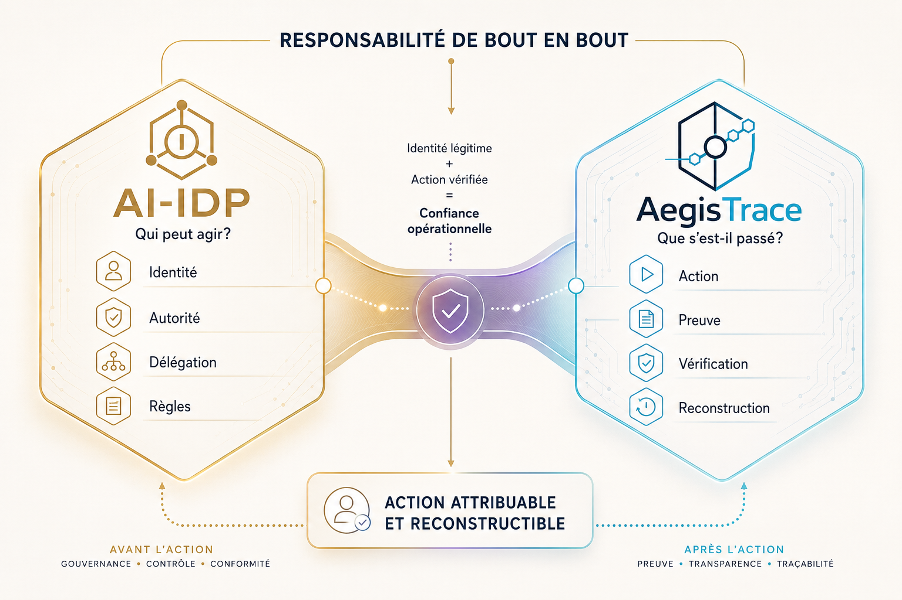

<!--
© 2026 Pierre-Edward Procyk. All rights reserved.
IP_HEADER: Public plain-language guide for AI-IDP and AegisTrace.
DATA_HEADER: Explanations are illustrative; legal, deployment, and certification claims remain explicitly bounded.
CODE_ANNOTATION: v2.1.0 | 2026-09-07 | English and Canadian French consumer guide.
-->

# AI-IDP + AegisTrace, in plain language

## English

### Why this exists

AI systems are beginning to do more than answer questions. They can prepare transactions, call software tools, change records, trigger business workflows, and coordinate with other AI systems.

When an AI action matters, organizations and affected people need more than “the computer did it.” They need a reliable way to answer:

- Which AI acted?
- Which copy or running instance of that AI acted?
- Who controlled and authorized it?
- What was it allowed to do?
- What did it actually do?
- What evidence remains if the decision is questioned later?

AI-IDP and AegisTrace are designed around those questions.

### What AI-IDP does

AI-IDP is the proposed identity and delegation framework. It focuses on the controls that should exist before an AI system acts:

- a persistent identity for the AI actor;
- a separate identity for each running instance;
- a clear relationship to the responsible principal and controller;
- a defined delegation, purpose, scope, time window, and resource boundary;
- explicit approval when the action requires it;
- a fail-closed decision when required authority or evidence is missing.

In short: **AI-IDP helps establish who may act and under what authority.**

### What AegisTrace does

AegisTrace is the reference implementation that produces and verifies evidence after an action:

- a structured event record;
- a cryptographic digest of the event;
- a link to the previous event;
- a signature tied to a registered verification key;
- authorization, approval, task, resource, and execution context;
- public-safe disclosure views that exclude restricted fields by default;
- verification tools for detecting alteration or a broken chain.

In short: **AegisTrace helps prove what happened and whether the evidence still verifies.**

### A simple example

Suppose an AI assistant can submit a supplier purchase request.

AI-IDP asks whether that specific AI instance has authority for that type of purchase, for that organization, within the permitted amount, period, and approval rules.

AegisTrace records the authorized action and its evidence so an auditor can later determine which actor acted, which approval applied, what was submitted, and whether the record was changed.

The framework does not guarantee that the business decision was wise. It creates stronger evidence about identity, authority, action, and accountability.

### Who may find it useful

- organizations introducing tool-using or action-taking AI;
- software teams building agentic systems;
- security, privacy, legal, risk, and internal-audit teams;
- policy makers and standards bodies;
- researchers studying accountable AI infrastructure;
- people affected by automated or AI-assisted decisions.

### What is real today

Version 2.1.0 contains a functional Python implementation, formal specifications, JSON Schemas, tests, a threat model, documentation, policy research, and worked examples.

The local 2026-09-07 verification recorded 162 passing tests and two deliberately opt-in native post-quantum tests. It also verified a four-event governed demo, the full hash chain, and four Ed25519 signatures.

External production services, credentials, hardware security modules, independent registry operators, formal certification, regulatory acceptance, and legal adoption are separate matters and are not implied by the source code.

### Rights and community context

AI-IDP does not replace applicable privacy, human-rights, employment, consumer-protection, contractual, sectoral, or community-governance obligations.

Meaningful Indigenous rights-holder engagement is required where a deployment materially involves Indigenous rights, community data, governance authority, agreements, or services. It is not presented as a universal requirement for unrelated deployments.

### What this is not

- It is not current Canadian law.
- It is not a government, university, or standards-body certification.
- It is not proof that every documented adapter has operated against a live external system.
- It is not permission to use the project’s source, documents, logos, or media.
- It is not a claim that cryptographic evidence alone resolves every legal, ethical, or operational question.

---

## Français

### Pourquoi ce projet existe

Les systèmes d’IA ne font plus seulement répondre à des questions. Ils peuvent préparer des transactions, appeler des outils logiciels, modifier des dossiers, déclencher des processus d’affaires et coordonner leur travail avec d’autres systèmes d’IA.

Lorsqu’une action d’IA a des conséquences, il ne suffit pas de dire que « l’ordinateur l’a fait ». Les organisations et les personnes concernées doivent pouvoir déterminer :

- quelle IA a agi;
- quelle instance d’exécution a réalisé l’action;
- qui la contrôlait et l’avait autorisée;
- ce qu’elle avait le droit de faire;
- ce qu’elle a réellement fait;
- quelle preuve demeure disponible si l’action est contestée.

AI-IDP et AegisTrace sont conçus autour de ces questions.

### Le rôle d’AI-IDP

AI-IDP est le cadre proposé pour l’identité et la délégation. Il porte sur les contrôles qui devraient être établis avant qu’une IA agisse :

- une identité persistante pour l’acteur IA;
- une identité distincte pour chaque instance d’exécution;
- un lien clair avec le mandant et le contrôleur responsables;
- une délégation, une finalité, une portée, une période et des ressources bien définies;
- une approbation explicite lorsque l’action l’exige;
- un refus par défaut lorsque l’autorité ou la preuve requise est absente.

En bref : **AI-IDP aide à établir qui peut agir et sous quelle autorité.**

### Le rôle d’AegisTrace

AegisTrace est l’implémentation de référence qui produit et vérifie la preuve après une action :

- un événement structuré;
- une empreinte cryptographique de l’événement;
- un lien avec l’événement précédent;
- une signature liée à une clé de vérification enregistrée;
- le contexte de tâche, d’autorisation, d’approbation, de ressource et d’exécution;
- des vues publiques limitées aux champs autorisés;
- des outils permettant de détecter une modification ou une rupture de chaîne.

En bref : **AegisTrace aide à prouver ce qui s’est passé et à vérifier l’intégrité de la preuve.**

### Un exemple simple

Supposons qu’un assistant d’IA puisse soumettre une demande d’achat à un fournisseur.

AI-IDP vérifie si cette instance précise possède l’autorité nécessaire pour ce type d’achat, pour cette organisation, dans les limites, la période et les règles d’approbation applicables.

AegisTrace enregistre l’action autorisée et sa preuve afin qu’un audit puisse ensuite déterminer quel acteur a agi, quelle approbation s’appliquait, ce qui a été soumis et si la preuve a été modifiée.

Le cadre ne garantit pas que la décision d’affaires était judicieuse. Il renforce la preuve concernant l’identité, l’autorité, l’action et la responsabilité.

### À qui ce travail peut être utile

- aux organisations qui introduisent des agents d’IA capables d’utiliser des outils ou d’agir;
- aux équipes qui développent des systèmes agentiques;
- aux fonctions de sécurité, de protection des renseignements personnels, de droit, de risque et d’audit interne;
- aux responsables de politiques et aux organismes de normalisation;
- aux chercheurs en gouvernance et en responsabilité de l’IA;
- aux personnes touchées par des décisions automatisées ou assistées par l’IA.

### Ce qui existe réellement

La version 2.1.0 comprend une implémentation Python fonctionnelle, des spécifications formelles, des schémas JSON, des tests, un modèle de menaces, de la documentation, des analyses de politiques et des exemples.

La vérification locale du 7 septembre 2026 a enregistré 162 tests réussis et deux tests post-quantiques natifs laissés en activation explicite. Elle a également vérifié une démonstration gouvernée de quatre événements, la chaîne complète d’empreintes et quatre signatures Ed25519.

Les services externes en production, les justificatifs d’accès, les modules matériels de sécurité, les exploitants indépendants de registres, la certification formelle, l’acceptation réglementaire et l’adoption législative demeurent des étapes distinctes.

### Droits et contexte communautaire

AI-IDP ne remplace pas les obligations applicables en matière de protection des renseignements personnels, de droits de la personne, d’emploi, de consommation, de contrat, de réglementation sectorielle ou de gouvernance communautaire.

Une mobilisation significative des détenteurs de droits autochtones demeure requise lorsqu’un déploiement touche matériellement des droits autochtones, des données communautaires, une autorité de gouvernance, des ententes ou des services. Cette exigence n’est pas présentée comme une condition universelle pour les déploiements sans lien matériel avec ces enjeux.

### Ce que le projet ne prétend pas

- Il ne constitue pas le droit canadien actuel.
- Il ne constitue pas une certification gouvernementale, universitaire ou normative.
- Il ne prouve pas que chaque adaptateur documenté a été activé dans un système externe réel.
- Il n’accorde aucun droit d’utilisation du code, des documents, des logos ou des médias.
- Il ne prétend pas que la preuve cryptographique règle à elle seule toute question juridique, éthique ou opérationnelle.

---

## Continue

- [Return to the project overview / Retour au projet](../README.md)
- [View the visual gallery / Voir la galerie](media/README.md)
- [Read the verified project status / Consulter l’état vérifié](../project-control/PROJECT_STATUS.md)
- [Start the reference implementation / Démarrer l’implémentation](quickstart.md)
