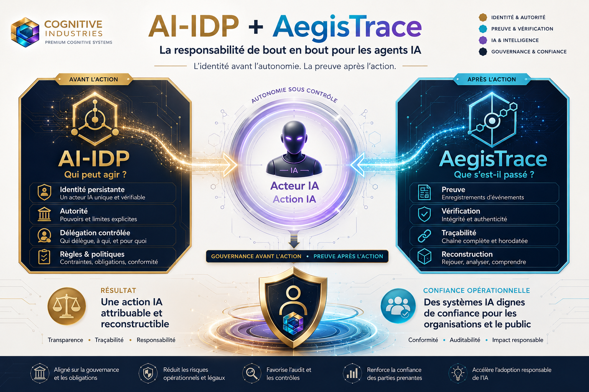
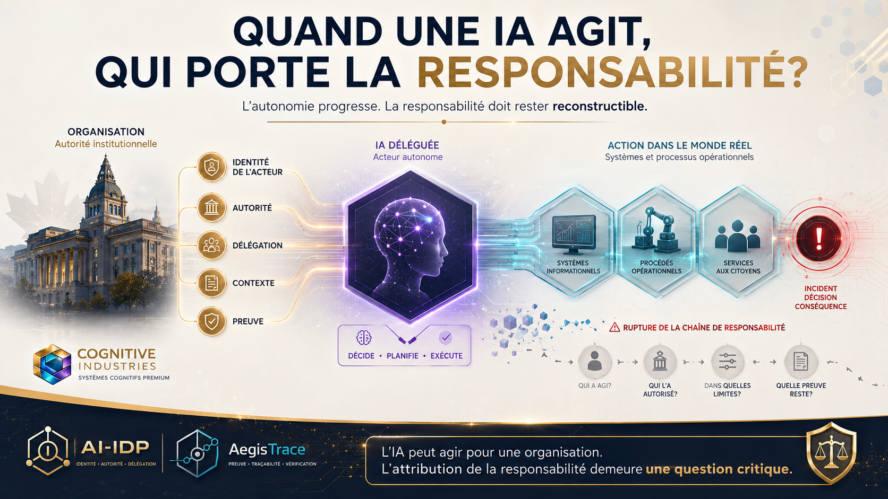
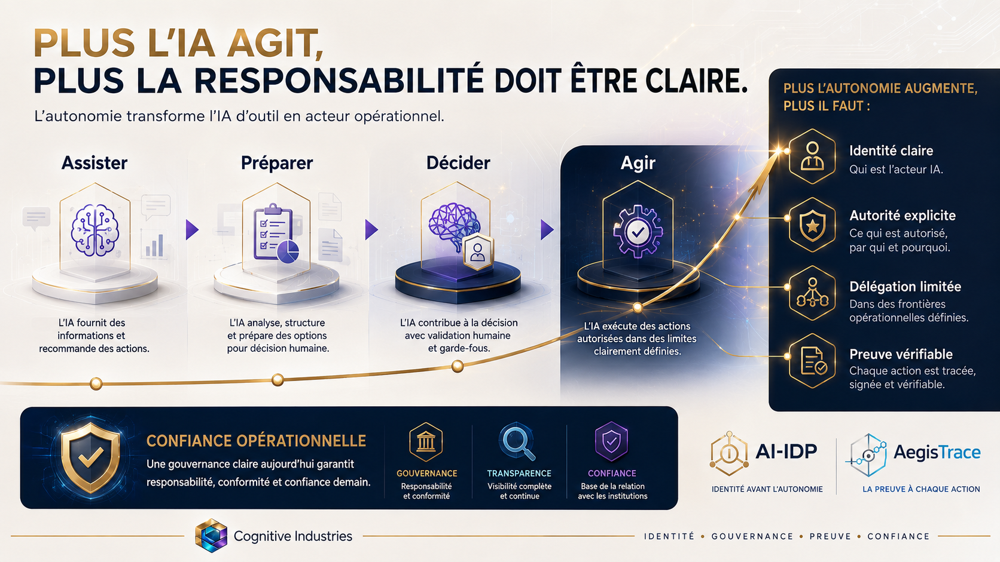
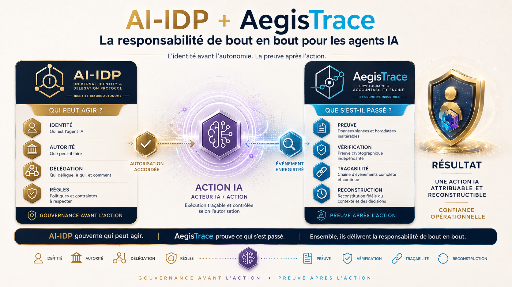
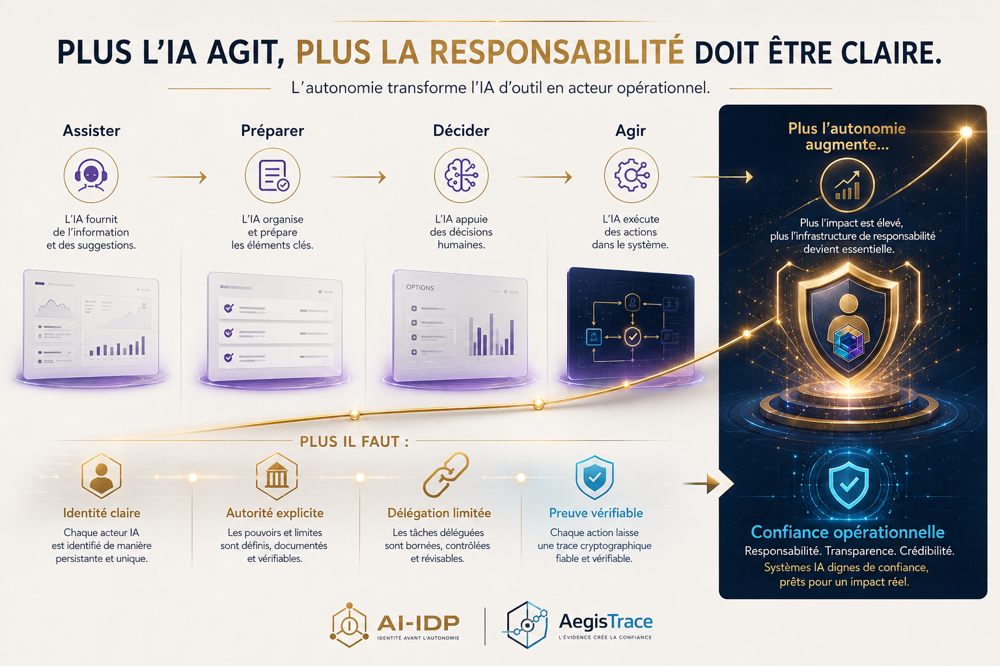

<!--
© 2026 Pierre-Edward Procyk. All rights reserved.
IP_HEADER: Public AI-IDP and AegisTrace visual gallery.
DATA_HEADER: Images are explanatory project media; captions do not expand legal or implementation claims.
CODE_ANNOTATION: v2.1.0 | 2026-09-07 | Curated article and social-media gallery.
-->

# AI-IDP + AegisTrace visual gallery

These existing project visuals explain the relationship between identity, authority, delegation, action, evidence, and accountability. They were selected from the rights holder’s official local archive and copied byte-for-byte; no logo or image was regenerated, recoloured, cropped, or altered for this repository.

The images are primarily in Canadian French because they were developed for AI-IDP/AegisTrace articles and professional social-media communication from Québec.

## Identity before autonomy

Before granting more autonomy, establish the AI actor’s identity, authority, delegation, and operational limits.

## The complete model

AI-IDP governs who may act before the action. AegisTrace preserves verifiable evidence after the action.

## Who carries responsibility?

The accountability chain connects the organization, the AI actor, delegated authority, operational systems, affected services, and the evidence needed after an incident or decision.

## More autonomy requires clearer accountability

As AI moves from assistance to preparation, decision support, and action, identity, authority, delegation, and evidence become more important.

## Governance before autonomy

Autonomy should follow verified identity, authority, limits, action controls, and evidence—not precede them.

## End-to-end accountability

AI-IDP provides the pre-action governance model; AegisTrace provides post-action evidence and verification.

## Proof after action

The intended result is an AI action that can be attributed and reconstructed using signed, timestamped, linked evidence.

## Four stages of accountable operation

The progression from assisting to acting increases the need for clear identity, explicit authority, limited delegation, and verifiable proof.

## Provenance and rights

The [media manifest](MEDIA_MANIFEST.md) records the source filename, repository filename, size, dimensions, and SHA-256 digest for every published logo and visual.

All project marks and graphics are proprietary. Repository display does not grant reproduction, modification, redistribution, endorsement, model-training, commercial-use, or sublicensing rights. See the project’s [Trademark and Brand Policy](../../TRADEMARK_AND_BRAND_POLICY.md).

© 2026 Pierre-Edward Procyk. Cognitive Industries — Les Industries Cognitives. All rights reserved.
